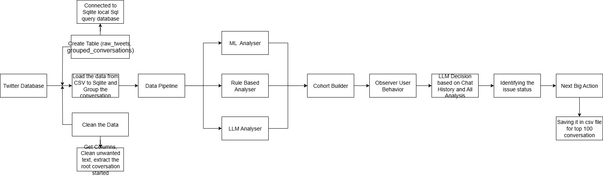

# Riverline-ML
ahh soo much work to do, let's get it done

#  Riverline NBA System
### Next Best Action Engine for Customer Support Optimization

A comprehensive machine learning pipeline that analyzes customer support conversations and generates intelligent channel recommendations to maximize issue resolution rates.

---

## 🏗️ **Project Architecture**

```
📁 Riverline-ML-Assessment/
├── 📁 dataset/
│   └── 📄 twcs.csv                    # Raw customer support conversation data
├── 📁 data_pipeline/
│   ├── 📄 __init__.py                 # Package initialization
│   ├── 📄 app.py                 # Main data processing orchestrator
│   ├── 📄 data_clean.py               # Data cleaning and conversation threading
│   └── 📄 data_store.py               # SQLite database operations and storage
├── 📁 observe_user_behavior/
│   ├── 📄 __init__.py                 # Package initialization
│   ├── 📄 app.py                      # User behavior analysis coordinator
│   ├── 📄 hybrid_analyzer.py          # Rule-based + ML + Gemini LLM analyzer
│   ├── 📄 gemini_analyzer.py          # Pure Gemini LLM conversation analysis
│   ├── 📄 cohort_builder.py           # Customer segmentation and cohort creation
├── 📁 next_best_action/
│   ├── 📄 __init__.py                 # Package initialization
│   ├── 📄 app.py                      # NBA engine main coordinator
│   ├── 📄 decision_engine.py          # Gemini-powered channel selection logic
│   ├── 📄 channel_optimizer.py        # Business rules and timing optimization
├── 📄 main.py                         # System entry point and workflow orchestrator
├── 📄 requirements.txt                # Python dependencies and versions
├── 📄 .env.example                    # Environment variables template
├── 📄 results.csv                     # Generated NBA recommendations output
├── 📄 riverline.db                    # SQLite database with processed data
└── 📄 README.md                       # Project documentation (this file)
└── 📄 Dockerfile                      # To run in Docker container

```

---

**Data Flow:**
`Raw Conversations` → `Data Cleaning & Threading` → `Database Storage` → `Hybrid Analysis (Rule+ML+LLM)` → `Customer Segmentation` → `NBA Decision Engine` → `Gemini LLM Reasoning` → `CSV Export`

---

##  **Screenshots**

### **System Architecture**

*Hybrid analysis pipeline combining rule-based, ML, and LLM approaches*

### **Console Output**

*Finding out whether the chat is resolved or unresolved*

### **CSV Results**

*Generated Cohorts from LLM*

---

##  **Module Components**

### ** Data Pipeline**
| File | Purpose |
|------|---------|
| `pipeline.py` | Orchestrates data ingestion, cleaning, and conversation grouping |
| `data_clean.py` | Handles text cleaning, conversation threading, and ML preprocessing |
| `data_store.py` | SQLite database operations, schema creation, and data persistence |

### ** User Behavior Analysis**
| File | Purpose |
|------|---------|
| `app.py` | Coordinates conversation analysis and cohort building workflows |
| `hybrid_analyzer.py` | Combines rule-based, ML models, and Gemini LLM for analysis |
| `gemini_analyzer.py` | Pure Gemini LLM conversation analysis and classification |
| `cohort_builder.py` | Customer segmentation based on behavior patterns and tags |

### ** Next Best Action Engine**
| File | Purpose |
|------|---------|
| `app.py` | NBA workflow orchestration and CSV generation |
| `decision_engine.py` | Gemini LLM-powered channel selection and reasoning |
| `channel_optimizer.py` | Business constraints, timing rules, and message optimization |

---

##  **How to Run**

### **Prerequisites**
```bash
# 1. Clone the repository
git clone <repository-url>
cd Riverline-ML

# 2. Create virtual environment
python -m venv venv
source venv/bin/activate  # On Windows: venv\Scripts\activate

# 3. Install dependencies
pip install -r requirements.txt
```

### **Environment Setup**
```bash
# 4. Create .env file with your Gemini API key
echo "GEMINI_API_KEY=your_actual_api_key_here" > .env

# 5. Ensure dataset is in place
# Place your conversation data in: dataset/twcs.csv
```

### **Run the System**
```bash
# 6. Execute the full pipeline
python main.py
```


---

##  **System Architecture Highlights**

### ** Hybrid Analysis Approach**
- **Rule-Based**: Fast pattern matching for resolution detection and urgency
- **ML Models**: NLTK sentiment analysis and scikit-learn classification
- **Gemini LLM**: Complex reasoning, edge cases, and nuanced understanding

### ** Performance Optimizations**
- **Cost-Effective**: Gemini used only for complex cases (~20% of conversations)
- **Fast Processing**: Rule-based and ML models handle majority of analysis
- **Scalable**: Modular architecture supports easy component replacement

### ** Business Intelligence**
- **Customer Segmentation**: Automatic cohort creation based on behavior patterns
- **Resolution Prediction**: Gemini LLM predicts action outcomes
- **Channel Optimization**: Smart selection between Twitter, Email, and Phone

---


### **CSV Output (results.csv)**
| customer_id | channel | message | reasoning | chat_log | issue_status |
|-------------|---------|---------|-----------|----------|--------------|
| 115712 | twitter_dm_reply | "Hi John, I understand your billing frustration..." | "Phone call needed for frustrated customer requiring personal attention." | "Customer: My bill is wrong\nAgent: I'll help you" | pending_customer_reply |

---

## **Technical Standards**

### **Code Quality**
-  **Ruff Checks Passed**: Strict linting and formatting standards
-  **UV Project**: Modern Python dependency management
-  **Modular Architecture**: Clean separation of concerns
-  **Type Safety**: Proper error handling and validation

---

##  **Architecture Patterns**

### **Design Principles**
- **Single Responsibility**: Each module has one clear purpose
- **Dependency Injection**: Components can be easily swapped
- **Factory Pattern**: Dynamic analyzer selection based on complexity
- **Observer Pattern**: Pipeline stages communicate through events

---


##  **Acknowledgments**

**Special thanks to Riverline for this engaging challenge!** 

This project has been an incredible journey back into the world of machine learning. It's been quite some time since I've dove deep into ML, and working on this NBA system has genuinely refreshed my memory and reignited my passion for the field. 

---
*Built with ❤️ using Python, Gemini AI, and modern ML practices*