# Riverline-ML
ahh soo much work to do, let's get it done

# 🎯 Riverline NBA System
### Next Best Action Engine for Customer Support Optimization

A comprehensive machine learning pipeline that analyzes customer support conversations and generates intelligent channel recommendations to maximize issue resolution rates.

---

## 🏗️ **Project Architecture**

```
📁 Riverline-ML-Assessment/
├── 📁 dataset/
│   └── 📄 twcs.csv                    # Raw customer support conversation data
├── 📁 data_pipeline/
│   ├── 📄 __init__.py                 # Package initialization
│   ├── 📄 pipeline.py                 # Main data processing orchestrator
│   ├── 📄 data_clean.py               # Data cleaning and conversation threading
│   └── 📄 data_store.py               # SQLite database operations and storage
├── 📁 observe_user_behavior/
│   ├── 📄 __init__.py                 # Package initialization
│   ├── 📄 app.py                      # User behavior analysis coordinator
│   ├── 📄 hybrid_analyzer.py          # Rule-based + ML + Gemini LLM analyzer
│   ├── 📄 gemini_analyzer.py          # Pure Gemini LLM conversation analysis
│   ├── 📄 cohort_builder.py           # Customer segmentation and cohort creation
│   └── 📄 config.py                   # Analysis configuration and thresholds
├── 📁 next_best_action/
│   ├── 📄 __init__.py                 # Package initialization
│   ├── 📄 app.py                      # NBA engine main coordinator
│   ├── 📄 decision_engine.py          # Gemini-powered channel selection logic
│   ├── 📄 channel_optimizer.py        # Business rules and timing optimization
│   └── 📄 config.py                   # NBA rules and channel constraints
├── 📄 main.py                         # System entry point and workflow orchestrator
├── 📄 requirements.txt                # Python dependencies and versions
├── 📄 .env.example                    # Environment variables template
├── 📄 results.csv                     # Generated NBA recommendations output
├── 📄 riverline.db                    # SQLite database with processed data
└── 📄 README.md                       # Project documentation (this file)
```

---

## 🔄 **System Flow**

```mermaid
graph TD
    A[📄 Raw CSV Data] --> B[🔧 Data Pipeline]
    B --> C[🗄️ SQLite Database]
    C --> D[🧠 Hybrid Analysis Engine]
    D --> E[👥 Customer Cohorts]
    D --> F[🏷️ Conversation Tags]
    E --> G[🎯 NBA Engine]
    F --> G
    G --> H[🤖 Gemini LLM]
    H --> I[📊 Channel Recommendations]
    I --> J[📋 results.csv]
    
    style A fill:#e1f5fe
    style B fill:#f3e5f5
    style D fill:#e8f5e8
    style G fill:#fff3e0
    style H fill:#fce4ec
    style J fill:#e0f2f1
```



**Data Flow:**
`Raw Conversations` → `Data Cleaning & Threading` → `Database Storage` → `Hybrid Analysis (Rule+ML+LLM)` → `Customer Segmentation` → `NBA Decision Engine` → `Gemini LLM Reasoning` → `CSV Export`

---

## 🧩 **Module Components**

### **📊 Data Pipeline**
| File | Purpose |
|------|---------|
| `pipeline.py` | Orchestrates data ingestion, cleaning, and conversation grouping |
| `data_clean.py` | Handles text cleaning, conversation threading, and ML preprocessing |
| `data_store.py` | SQLite database operations, schema creation, and data persistence |

### **🧠 User Behavior Analysis**
| File | Purpose |
|------|---------|
| `app.py` | Coordinates conversation analysis and cohort building workflows |
| `hybrid_analyzer.py` | Combines rule-based, ML models, and Gemini LLM for analysis |
| `gemini_analyzer.py` | Pure Gemini LLM conversation analysis and classification |
| `cohort_builder.py` | Customer segmentation based on behavior patterns and tags |
| `config.py` | Analysis thresholds, model parameters, and business rules |

### **🎯 Next Best Action Engine**
| File | Purpose |
|------|---------|
| `app.py` | NBA workflow orchestration and CSV generation |
| `decision_engine.py` | Gemini LLM-powered channel selection and reasoning |
| `channel_optimizer.py` | Business constraints, timing rules, and message optimization |
| `config.py` | NBA rules, channel preferences, and success metrics |

---

## 🚀 **How to Run**

### **Prerequisites**
```bash
# 1. Clone the repository
git clone <repository-url>
cd Riverline-ML-Assessment

# 2. Create virtual environment
python -m venv venv
source venv/bin/activate  # On Windows: venv\Scripts\activate

# 3. Install dependencies
pip install -r requirements.txt
```

### **Environment Setup**
```bash
# 4. Create .env file with your Gemini API key
echo "GEMINI_API_KEY=your_actual_api_key_here" > .env

# 5. Ensure dataset is in place
# Place your conversation data in: dataset/twcs.csv
```

### **Run the System**
```bash
# 6. Execute the full pipeline
python main.py
```

### **Expected Output**
```
✅ Data Pipeline: Conversations grouped and stored
✅ Behavior Analysis: Customer tags and cohorts created  
✅ NBA Engine: Channel recommendations generated
💾 Results saved to 'results.csv'
```

---

## 📈 **System Architecture Highlights**

### **🔧 Hybrid Analysis Approach**
- **Rule-Based**: Fast pattern matching for resolution detection and urgency
- **ML Models**: NLTK sentiment analysis and scikit-learn classification
- **Gemini LLM**: Complex reasoning, edge cases, and nuanced understanding

### **⚡ Performance Optimizations**
- **Cost-Effective**: Gemini used only for complex cases (~20% of conversations)
- **Fast Processing**: Rule-based and ML models handle majority of analysis
- **Scalable**: Modular architecture supports easy component replacement

### **🎯 Business Intelligence**
- **Customer Segmentation**: Automatic cohort creation based on behavior patterns
- **Resolution Prediction**: Gemini LLM predicts action outcomes
- **Channel Optimization**: Smart selection between Twitter, Email, and Phone

---

## 📊 **Sample Output**

### **Console Output**
```
📊 RESOLUTION STATISTICS:
   Total Conversations: 15
   ✅ Already Resolved: 7 (EXCLUDED from NBA)
   🔓 Unresolved: 8 (PROCESSING for NBA)

🔮 GEMINI LLM ISSUE STATUS PREDICTIONS:
   📊 Resolved: 5 (62.5%)
   📊 Pending Customer Reply: 3 (37.5%)

📈 POTENTIAL IMPACT:
   Gemini predicted resolution rate improvement: 62.5%
```

### **CSV Output (results.csv)**
| customer_id | channel | message | reasoning | chat_log | issue_status |
|-------------|---------|---------|-----------|----------|--------------|
| 115712 | scheduling_phone_call | "Hi John, I understand your billing frustration..." | "Phone call needed for frustrated customer requiring personal attention." | "Customer: My bill is wrong\nAgent: I'll help you" | pending_customer_reply |

---

## 🛠️ **Technical Standards**

### **Code Quality**
- ✅ **Ruff Checks Passed**: Strict linting and formatting standards
- ✅ **UV Project**: Modern Python dependency management
- ✅ **Modular Architecture**: Clean separation of concerns
- ✅ **Type Safety**: Proper error handling and validation

### **Scalability Features**
- 🔧 **Plugin Architecture**: Easy to add new analysis methods
- 📊 **Database Abstraction**: Simple to switch storage backends  
- 🤖 **LLM Flexibility**: Easy to integrate different AI models
- ⚙️ **Configuration-Driven**: Business rules externalized in config files

---

## 🧪 **Architecture Patterns**

### **Design Principles**
- **Single Responsibility**: Each module has one clear purpose
- **Dependency Injection**: Components can be easily swapped
- **Factory Pattern**: Dynamic analyzer selection based on complexity
- **Observer Pattern**: Pipeline stages communicate through events

### **Error Handling**
- **Graceful Degradation**: Fallback mechanisms for each analysis method
- **Comprehensive Logging**: Detailed tracking for debugging and monitoring
- **Input Validation**: Robust handling of malformed data
- **Recovery Strategies**: Multiple fallback options for API failures

---

## 📸 **Screenshots**

### **System Architecture**

*Hybrid analysis pipeline combining rule-based, ML, and LLM approaches*

### **Console Output**

*Real-time processing status and prediction results*

### **CSV Results**

*Generated recommendations with chat logs and Gemini reasoning*

---

## 🎓 **Learning Outcomes**

This project successfully demonstrates:

- **🔄 End-to-End ML Pipeline**: From raw data to actionable business insights
- **🤖 LLM Integration**: Practical use of Gemini AI for business decision making
- **📊 Hybrid Modeling**: Combining rule-based, traditional ML, and modern LLM approaches
- **🏗️ Production Architecture**: Scalable, maintainable code structure
- **💼 Business Value**: Quantifiable impact on customer support efficiency

---

## 🙏 **Acknowledgments**

**Special thanks to Riverline for this engaging challenge!** 

This project has been an incredible journey back into the world of machine learning. It's been quite some time since I've dove deep into ML, and working on this NBA system has genuinely refreshed my memory and reignited my passion for the field. 

The combination of traditional ML techniques with modern LLM capabilities, wrapped in a real-world business application, made this particularly rewarding. Building a system that can actually improve customer support outcomes while learning about NBA principles has been both educational and fulfilling.

**It feels great to be back in the ML game! 🚀**

---

## 📞 **Support**

For questions or issues:
- 📧 Email: [your-email@example.com]
- 💬 GitHub Issues: [Create an issue](repository-issues-url)
- 📖 Documentation: [Wiki](repository-wiki-url)

---

*Built with ❤️ using Python, Gemini AI, and modern ML practices*